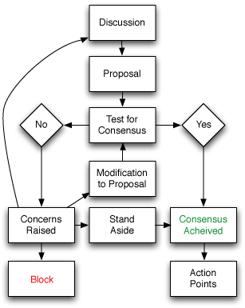

(Sysnthesized from Act Up's [Consensus Decision
Making](http://www.actupny.org/documents/CDdocuments/Consensus.html) and
Consensus Decision-Making's [The Basics of Consensus
Decision-Making](http://consensusdecisionmaking.org/Articles/Basics%20of%20Consensus%20Decision%20Making.html))

#Consensus Decision Making

##What is Consensus?

Consensus is a process for group decision-making. It is a method by which an entire group of people can come to an agreement. The input and ideas of all participants are gathered and synthesized to arrive at a final decision acceptable to all. Through consensus, we are not only working to achieve better solutions, but also to promote the growth of community and trust.

##The Principles of Consensus Decision Making
Consensus appears as a process in many different forms, however there are many common elements that are definitive of consensus decision making. These include being:

* Inclusive: As many stakeholders as possible are involved in group discussions.

* Participatory: All participants are allowed a chance to contribute to the discussion.

* Collaborative: The group constructs proposals with input from all interested group members. Any individual authorship of a proposal is subsumed as the group modifies it to include the concerns of all group members.

* Agreement Seeking: The goal is to generate as much agreement as possible. Regardless of how much agreement is required to finalize a decision, a group using a consensus process makes a concerted attempt to reach full agreement.

* Cooperative: Participants are encouraged to keep the good of the whole group in mind. Each individual’s preferences should be voiced so that the group can incorporate all concerns into an emerging proposal. Individual preferences should not, however, obstructively impede the progress of the group.

##Consensus vs. Voting

Voting is a means by which we choose one alternative from several. Consensus, on the other hand, is a process of synthesizing many diverse elements together.

Voting is a win or lose model, in which people are more often concerned with the numbers it takes to "win" than with the issue itself. Voting does not take into account individual feelings or needs. In essence, it is a quantitative, rather than qualitative, method of decision-making.

With consensus people can and should work through differences and reach a mutually satisfactory position. It is possible for one person's insights or strongly held beliefs to sway the whole group. No ideas are lost, each member's input is valued as part of the solution.

A group committed to consensus may utilize other forms of decision making (individual, compromise, majority rules) when appropriate; however, a group that has adopted a consensus model will use that process for any item that brings up a lot of emotions, is something that concerns people's ethics, politics, morals or other areas where there is much investment.

##What Does Consensus Mean?

Consensus does not mean that everyone thinks that the decision made is necessarily the best one possible, or even that they are sure it will work. What it does mean is that in coming to that decision, no one felt that her/his position on the matter was misunderstood or that it wasn't given a proper hearing. Hopefully, everyone will think it is the best decision; this often happens because, when it works, collective intelligence does come up with better solutions than could individuals.

Consensus takes more time and member skill, but uses lots of resources before a decision is made, creates commitment to the decision and often facilitates creative decision. It gives everyone some experience with new processes of interaction and conflict resolution, which is basic but important skill-building. For consensus to be a positive experience, it is best if the group has 1) common values, 2) some skill in group process and conflict resolution, or a commitment to let these be facilitated, 3) commitment and responsibility to the group by its members and 4) sufficient time for everyone to participate in the process.

##Forming The Consensus Proposals

[Image from Wikipedia.](https://en.wikipedia.org/wiki/File:Consensus-flowchart.png)

During discussion a proposal for resolution is put forward. It is amended and modified through more discussion, or withdrawn if it seems to be a dead end. During this discussion period it is important to articulate differences clearly. It is the responsibility of those who are having trouble with a proposal to put forth alternative suggestions.

The fundamental right of consensus is for all people to be able to express themselves in their own words and of their own will. The fundamental responsibility of consensus is to assure others of their right to speak and be heard. Coercion and trade-offs are replaced with creative alternatives, and compromise with synthesis.

When a proposal seems to be well understood by everyone, and there are no new changes asked for, the facilitator(s) can ask if there are any objections or reservations to it. If there are no objections, there can be a call for consensus. If there are still no objections, then after a moment of silence you have your decision. Once consensus does appear to have been reached, it really helps to have someone repeat the decision to the group so everyone is clear on what has been decided.

##Difficulties In Reaching Consensus

If a decision has been reached, or is on the verge of being reached that you cannot support, there are several ways to express your objections:

* Non-support ("I don't see the need for this, but I'll go along.")

* Reservations ('I think this may be a mistake but I can live with it.")

* Standing aside ("I personally can't do this, but I won't stop others from doing it. ")

* Blocking ("I cannot support this or allow the group to support this. It is immoral." If a final decision violates someone's fundamental moral values they are obligated to block consensus.)

* Withdrawing from the group. Obviously, if many people express non-support or reservations or stand aside or leave the group, it may not be a viable decision even if no one directly blocks it. This is what is known as a "lukewarm" consensus and it is just as desirable as a lukewarm beer or a lukewarm bath.

If consensus is blocked and no new consensus can be reached, the group stays with whatever the previous decision was on the subject, or does nothing if that is applicable. Major philosophical or moral questions that will come up with each affinity group will have to be worked through as soon as the group forms.

##Roles In A Consensus Meeting

There are several roles which, if filled, can help consensus decision making run smoothly.

The **facilitator(s)** aids the group in defining decisions that need to be made, helps them through the stages of reaching an agreement, keeps the meeting moving, focuses discussion to the point-at hand; makes sure everyone has the opportunity to participate, and formulates and tests to see if consensus has been reached. Facilitators help to direct the process of the meeting, not its content. They never make decisions for the group. If a facilitator feels too emotionally involved in an issue or discussion and cannot remain neutral in behavior, if not in attitude, then s/he should ask someone to take over the task of facilitation for that agenda item.

A **vibes-watcher** is someone besides the facilitator who watches and comments on individual and group feelings and patterns of participation. Vibes-watchers need to be especially tuned in to the sexism of group dynamics.

A **recorder** can take notes on the meeting, especially of decisions made and means of implementation and a time-keeper keeps things going on schedule so that each agenda item can be covered in the time allotted for it (if discussion runs over the time for an item, the group may or may not decide to contract for more time to finish up).

Even though individuals take on these roles, all participants in a meeting should be aware of and involved in the issues, process, and feelings of the group, and should share their individual expertise in helping the group run smoothly and reach a decision. This is especially true when it comes to finding compromise agreements to seemingly contradictory positions.
